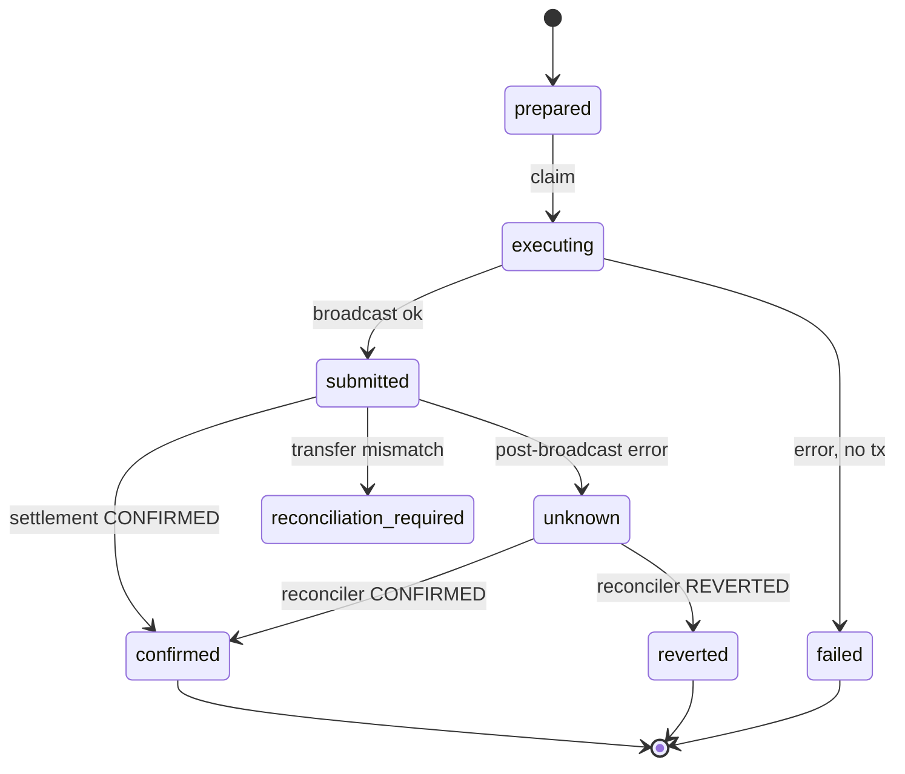

# CDP payment state machine

## Payment intent (`payment_intents.status`)

```text
prepared
  → executing        (execution claim — optimistic lock)
  → submitted        (tx broadcast, awaiting confirmation)
  → unknown          (post-broadcast failure — ambiguous)
  → confirmed        (settlement facts verified)
  → reverted         (chain receipt reverted)
  → reconciliation_required  (receipt ok, transfer facts mismatch)
  → failed           (no broadcast occurred)
  → executed         (legacy terminal)
```

## Guard authorization (`guard_status`)

```text
reserved   → budget atomically held at authorization
frozen     → broadcast occurred; budget locked until settlement truth
committed  → settlement confirmed; budget permanently consumed
released   → no broadcast, or chain reverted; budget returned
```

## Settlement (`settlement_status`)

```text
pending
confirmed
reverted
reconciliation_required
```

## Critical transitions

### Post-broadcast failure (INV-001)

```text
executing → submitted → [crash/RPC error]
                       → unknown + guard_status=frozen
                       → releaseGuard=false
```

### No-broadcast failure

```text
executing → failed + guard_status=released
```

### Reconciliation convergence (INV-005)

```text
unknown|submitted|reconciliation_required
  + tx_hash present
  → reconciler verifies settlement
  → CONFIRMED   → confirmed + committed
  → REVERTED    → reverted + released
  → MISMATCH    → reconciliation_required + frozen
  → PENDING     → no change
```

## Retry policy

Execution retry is **blocked** while status is `submitted`, `unknown`, or `reconciliation_required`.

## Correlation fields (migration 008)

Durable fields survive process restart:

- `payment_identifier` = `{intent_id}:{execution_idempotency_key}`
- `guard_authorization_id`, `guard_receipt_id`, `guard_fingerprint`
- `expected_chain_id`, `expected_token`, `expected_sender`, `expected_recipient`, `expected_amount`

## Diagram


